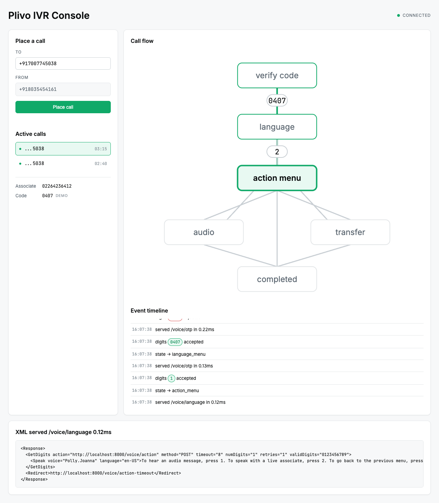
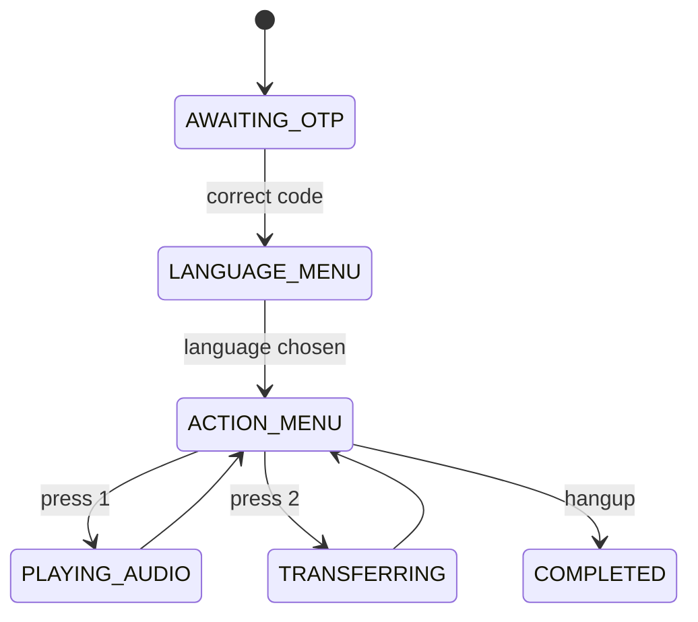

<div align="center">

# Plivo IVR Console

**A production shaped voice IVR with OTP authentication, built on Plivo, with a live console that shows the call state machine moving in real time.**

[](https://www.python.org/)
[](https://fastapi.tiangolo.com/)
[](https://www.typescriptlang.org/)
[](https://www.plivo.com/)
[](https://github.com/Abhay-BITS/Plivo-InspireWorks/actions/workflows/ci.yml)
[](#license)

</div>

---

## Table of contents

- [What this is](#what-this-is)
- [Console](#console)
- [Call flow](#call-flow)
- [Features](#features)
- [Tech stack](#tech-stack)
- [Project layout](#project-layout)
- [Prerequisites](#prerequisites)
- [Setup](#setup)
- [Environment variables](#environment-variables)
- [Tunnel setup](#tunnel-setup)
- [Placing a test call](#placing-a-test-call)
- [API reference](#api-reference)
- [Running the simulator with no phone](#running-the-simulator-with-no-phone)
- [Running the tests](#running-the-tests)
- [Running with Docker](#running-with-docker)
- [Design decisions](#design-decisions)
- [License](#license)

---

## What this is

An operator opens a control panel, enters a destination number, and clicks
a button. Plivo places an outbound call. When the person answers, they
hear a four digit access code prompt, then a bilingual language menu,
then an action menu offering an audio message or a transfer to a live
associate, and every wrong digit or silence re-prompts the same level
rather than dropping the call.

The console is the differentiator: it shows the call moving through this
flow live, the current state, the digits pressed, webhook latency, and
the exact Plivo XML served at every turn.

> **The demo access code is `0407`.** A reviewer cannot exercise the
> system without it, so it is stated here plainly. See
> [Environment variables](#environment-variables) for why this is
> different from the real Plivo credentials, which never enter this
> repository.

## Console



*The console mid call: the state graph lit up to the active node, the
event timeline scrolling live, and the exact XML Plivo just served.*

## Call flow



The full diagram, plus the literal XML served at every step including
the timeout paths, is in [docs/CALL_FLOW.md](docs/CALL_FLOW.md).

## Features

| Feature | Detail |
| --- | --- |
| OTP gate | Four digit hardcoded access code, loops on a wrong entry or silence, never advances on a guess |
| Bilingual menu | English and Spanish, `Polly.Joanna` and `Polly.Conchita`, selected once and carried through the rest of the call |
| Action menu | Audio playback or live transfer, with a 9 to go back and a spoken fallback if the transfer fails |
| No input handling | Every `GetDigits` is followed by a `Redirect` to a level specific timeout endpoint, so silence re-prompts instead of ending the call |
| Live console | WebSocket fed state graph, event timeline, and XML inspector, replaying the last fifty events to a browser that connects mid call |
| Concurrency | Sessions keyed by Plivo's `CallUUID`, two calls in flight hold independent state, both visible in the dashboard |
| Signature validation | Plivo V3 signature checked against the exact tunnel URL, not the ASGI request's own view of itself |
| Fail safe | An unhandled exception in any voice route returns valid Plivo XML with an apology and a hangup, never a silent 500 |
| Offline simulator | Drives the entire IVR against the app in process, no Plivo and no phone required |

## Tech stack

| Layer | Technology | Role |
| --- | --- | --- |
| Backend | Python 3.11, FastAPI, Uvicorn | Async webhook handlers, REST API |
| Telephony | `plivo` SDK, `plivoxml` | REST calls, XML generation, signature validation |
| State machine | Pure Python, no framework imports | `advance(session, event) -> Transition` |
| Realtime | Native FastAPI WebSocket | `/ws/live`, no socket.io, no broker |
| Frontend | Vanilla TypeScript, Vite | One page, hand authored SVG, zero UI framework |
| Testing | pytest, `httpx.AsyncClient` | Against the ASGI app, no real calls in the suite |
| Tooling | ruff, mypy strict | `app/` held to strict typing |
| Container | Docker, multi stage build | Node builds the console, Python runs the API |

## Project layout

```
app/
  telephony/       Plivo XML documents, the REST client, signature validation
  ivr/             the state machine and the prompt to XML rendering
  calls/           session storage, orchestration, rate limiting
  api/             FastAPI routers, one per concern
  observability/   structured logging, the per call event timeline
web/
  src/             the console: API/WS client, state graph, timeline,
                   XML inspector, call list
tests/             pytest, httpx against the ASGI app, no real calls
scripts/           the offline simulator
docs/              architecture, call flow, decisions, testing, demo script
```

## Prerequisites

- Python 3.11+
- Node 20+ (for the console)
- A Plivo account with a voice enabled number
- A tunnel (ngrok, cloudflared, or similar) if running locally, so Plivo
  can reach your machine

## Setup

1. Clone the repository and enter it.
2. Create a virtual environment and install the backend:
   ```bash
   python3 -m venv .venv
   source .venv/bin/activate
   pip install -e ".[dev]"
   ```
3. Install and build the console:
   ```bash
   cd web && npm install && npm run build && cd ..
   ```
4. Copy the environment template and fill in your Plivo credentials:
   ```bash
   cp .env.example .env
   ```
5. Start a tunnel and set `PUBLIC_BASE_URL` to it (see
   [Tunnel setup](#tunnel-setup)), then start the server:
   ```bash
   make run
   ```
6. Open `http://localhost:8000`. The built console is served from the
   same process; `web/dist` is mounted as static files by `app/main.py`.

## Environment variables

| Variable | Required | Description |
| --- | --- | --- |
| `PLIVO_AUTH_ID` | yes | From the Plivo console. Never committed; see below. |
| `PLIVO_AUTH_TOKEN` | yes | From the Plivo console. Never committed; see below. |
| `PLIVO_FROM_NUMBER` | yes | The Plivo number outbound calls are placed from. Defaults to `+918035454161`. |
| `DEFAULT_DESTINATION` | no | Prefills the console's destination field. Defaults to `+917007745038`. |
| `ASSOCIATE_NUMBER` | no | Number dialed when the caller presses 2 at the action menu. Defaults to `02264236412`. |
| `PUBLIC_BASE_URL` | yes | The URL Plivo can reach this server at, tunnel or deployed host. Every callback URL and signature check is built from this. |
| `OTP_CODE` | yes | The four digit access code. Defaults to `0407`. |
| `VERIFY_PLIVO_SIGNATURE` | no | Set to `false` to skip signature checks in local testing. Defaults to `true`. |
| `DEMO_MODE` | no | Shows the expected OTP code on the dashboard when `true`. Defaults to `true` locally. |
| `ACTION_AUDIO_URL` | no | The clip played when the caller presses 1 at the action menu. |
| `SESSION_TTL_MINUTES` | no | How long an idle call session is kept before eviction. Defaults to 30. |

> **Why the token above is never in this repository:** `.env.example`
> lists every variable name with an empty value, `.env` is gitignored
> from the first commit, and the real `PLIVO_AUTH_TOKEN` travels with a
> submission outside the repository rather than inside it. The OTP code
> is the one exception, stated plainly, because a reviewer cannot
> exercise the system without it.

## Tunnel setup

Plivo needs a public URL to reach this server. With ngrok:

```bash
ngrok http 8000
```

or with cloudflared, no account required:

```bash
cloudflared tunnel --url http://localhost:8000
```

Copy the `https://` forwarding URL into `PUBLIC_BASE_URL` in `.env`, then
start (or restart) the server. Every resolved callback URL is logged at
boot, so a stale tunnel is visible immediately rather than discovered mid
call:

```
callback url resolved: answer -> https://your-tunnel.example.com/voice/answer
```

## Placing a test call

With the server running and the tunnel pointed at it, either click
**Place call** in the console, or:

```bash
curl -X POST http://localhost:8000/api/calls \
  -H "Content-Type: application/json" \
  -d '{"to": "+917007745038"}'
```

```json
{ "request_uuid": "be9a3969-3287-486c-b2df-50c70fae9bc8", "to": "+917007745038" }
```

## API reference

| Method | Path | Description |
| --- | --- | --- |
| `POST` | `/api/calls` | Places an outbound call to the given destination |
| `GET` | `/api/calls` | Lists active calls |
| `GET` | `/api/calls/{call_uuid}` | Fetches one call's current state |
| `GET` | `/api/config` | Returns from number, default destination, and the demo OTP code |
| `GET` | `/health` | Liveness check |
| `WS` | `/ws/live` | Streams `state_change`, `dtmf`, `xml_served`, and `call_ended` events, replaying history on connect |
| `POST` | `/voice/*` | Plivo answer and menu webhooks, not called directly |
| `POST` | `/events/*` | Plivo hangup, fallback, and dial status webhooks, not called directly |

## Running the simulator with no phone

```bash
python scripts/simulate_call.py --digits 9999,0407,2,1
```

Drives the whole IVR against the app in process, no Plivo and no phone
involved, printing every prompt, the state transition, and the served XML
at each step. See [docs/TESTING.md](docs/TESTING.md) for more sequences.

## Running the tests

```bash
make check
```

runs `ruff`, `mypy --strict` on `app/`, and `pytest` with coverage on
`app/ivr` and `app/telephony`. See [docs/TESTING.md](docs/TESTING.md).

## Running with Docker

```bash
docker compose up --build
```

builds the console with Node, then the API image with Python, and serves
both from one container on port 8000.

## Design decisions

The state machine is isolated from the web framework on purpose, retries
are a counter rather than a state, and there is no database because
nothing here needs one longer than a demo session. The full reasoning,
including what was deliberately left out, is in
[docs/DECISIONS.md](docs/DECISIONS.md). Layering, how state is keyed and
evicted, and what changes to run more than one instance is in
[docs/ARCHITECTURE.md](docs/ARCHITECTURE.md).

## License

MIT.
