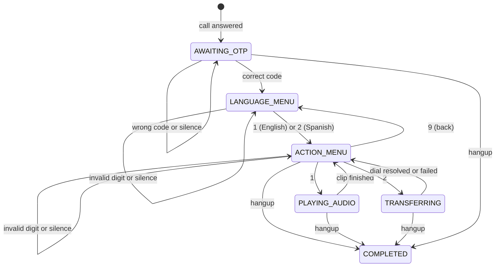

# Call flow

## State diagram



Every arrow above corresponds to one `advance()` call in
`app/ivr/machine.py`. There is no state named for a retry: a wrong code
and a timeout both loop `AWAITING_OTP` back to itself with `otp_attempts`
incremented, which is a counter on the session, not a place on this
diagram.

## Literal XML at every step

Callback URLs below use `https://your-tunnel.example.com` as
`PUBLIC_BASE_URL`; substitute your own tunnel or deployed host.

### 1. Call answered → code prompt

```xml
<Response><GetDigits action="https://your-tunnel.example.com/voice/otp" method="POST" timeout="8" numDigits="4" retries="1" validDigits="0123456789"><Speak voice="Polly.Joanna" language="en-US">Welcome. Please enter your four digit access code.</Speak></GetDigits><Redirect>https://your-tunnel.example.com/voice/otp-timeout</Redirect></Response>
```

### 2. Wrong code, or silence at the code prompt

`POST /voice/otp-timeout` (silence) and a wrong digit at `POST
/voice/otp` both produce the same shape, with the wording changing by
attempt count:

```xml
<Response><GetDigits action="https://your-tunnel.example.com/voice/otp" method="POST" timeout="8" numDigits="4" retries="1" validDigits="0123456789"><Speak voice="Polly.Joanna" language="en-US">That code was not correct. Please enter your four digit access code.</Speak></GetDigits><Redirect>https://your-tunnel.example.com/voice/otp-timeout</Redirect></Response>
```

### 3. Correct code → language menu

```xml
<Response><GetDigits action="https://your-tunnel.example.com/voice/language" method="POST" timeout="8" numDigits="1" retries="1" validDigits="0123456789"><Speak voice="Polly.Joanna" language="en-US">For English, press 1. Para espanol, presione 2.</Speak></GetDigits><Redirect>https://your-tunnel.example.com/voice/language-timeout</Redirect></Response>
```

### 4. Invalid digit, or silence, at the language menu

```xml
<Response><GetDigits action="https://your-tunnel.example.com/voice/language" method="POST" timeout="8" numDigits="1" retries="1" validDigits="0123456789"><Speak voice="Polly.Joanna" language="en-US">Sorry, that was not a valid choice. For English, press 1. Para espanol, presione 2.</Speak></GetDigits><Redirect>https://your-tunnel.example.com/voice/language-timeout</Redirect></Response>
```

### 5. Language selected → action menu (English)

```xml
<Response><GetDigits action="https://your-tunnel.example.com/voice/action" method="POST" timeout="8" numDigits="1" retries="1" validDigits="0123456789"><Speak voice="Polly.Joanna" language="en-US">To hear an audio message, press 1. To speak with a live associate, press 2. To go back to the previous menu, press 9.</Speak></GetDigits><Redirect>https://your-tunnel.example.com/voice/action-timeout</Redirect></Response>
```

### 5b. Action menu (Spanish)

```xml
<Response><GetDigits action="https://your-tunnel.example.com/voice/action" method="POST" timeout="8" numDigits="1" retries="1" validDigits="0123456789"><Speak voice="Polly.Conchita" language="es-ES">Para escuchar un mensaje de audio, presione 1. Para hablar con un asociado, presione 2. Para volver al menu anterior, presione 9.</Speak></GetDigits><Redirect>https://your-tunnel.example.com/voice/action-timeout</Redirect></Response>
```

### 6. Press 1 → audio, then back to the action menu

```xml
<Response><Play>https://s3.amazonaws.com/plivocloud/Trumpet.mp3</Play><Redirect>https://your-tunnel.example.com/voice/action-menu</Redirect></Response>
```

`POST /voice/action-menu` is the redirect target once the clip ends; it
feeds an `ACTION_DONE` event back into the machine and re-serves the
action menu document from step 5.

### 7. Press 2 → transfer, with a fallback if the dial fails

```xml
<Response><Speak voice="Polly.Joanna" language="en-US">Transferring you to a live associate. Please hold.</Speak><Dial action="https://your-tunnel.example.com/events/dial-status" method="POST" timeout="30" callerId="+918035454161" redirect="false"><Number>02264236412</Number></Dial><Speak voice="Polly.Joanna" language="en-US">We could not reach an associate right now.</Speak><Redirect>https://your-tunnel.example.com/voice/action-menu</Redirect></Response>
```

`redirect="false"` means Plivo fires `/events/dial-status` and discards
its response, then continues with whatever follows `Dial` in this same
document. The `Speak` and `Redirect` after it are what a failed transfer
actually hits; without them the caller would hear dead air followed by a
hangup.

### 8. Any unhandled exception in a voice route

```xml
<Response><Speak voice="Polly.Joanna" language="en-US">We are sorry, something went wrong on our end. Goodbye.</Speak><Hangup/></Response>
```

Served by the global exception handler in `app/main.py` for any route
under `/voice` or `/events`, and by `/events/fallback` if `answer_url`
itself never responds.
